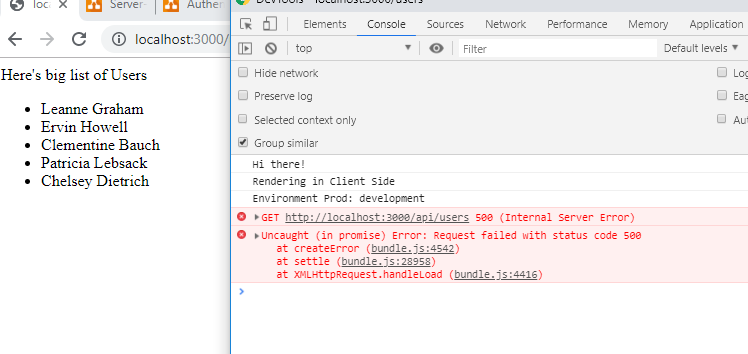

# Server Side Render

You can download this repository by using the green `Clone or Download` button on the right hand side of this page.  
This will present you with the option to either clone the repository using Git, or to download it as a zip file.

If you want to download it using git, copy paste the link that is presented to you, then run the following at your terminal:

```
git clone https://github.com/OsvaldoMartini/React_Redux_Server_Side_Render.git

cd React_Redux_Server_Side_Render

npm install
```

# Render Server Side with React

## Ignoring File with WebpackNodeExternals
```
 So anything that's inside the nome modules folder will not be included inside of our server side bundle.
 
 externals: [webpackNodeExternals()]
```

## Renderer Helper
```

 This helpes to separate out this express related logic inside "index.js"

```

## Implementing React Router Support
```
 New Way to Route wih (Router-ReactConfig)
 React-Router-Config
 It will help Us to figure Out hat set of components are about to be rendered. Give some Particular URL
```
## IIS-Express
```
If wew want to add in some route for some API handlers or some handler that to return some JSON or any outside requests
we might want to take in.

We can certainly add those as routing logic to express (or other Server Side like .Net MVC)
```

## React Router 
```
But anthing that is meant to show HTML out.
We are always going to  ake sure that React-Router is in charge of that request.

```

## BrowserRouter vs StaticRouter

## StaticRouter
This is a special Library from React

```
When we do our initial render of the app it's going to be using
the StaticRouter
```

This can be useful in server-side rendering scenarios when the user isn’t actually clicking around, 
so the location never actually changes. 

Hence, the name: static. It’s also useful in simple tests when you just need to plug in a location and make assertions 
on the render output.

check the sample:
```
Here’s an example node server that sends a 302 status code for <Redirect>s and regular HTML for other requests:
```
https://reacttraining.com/react-router/web/api/StaticRouter


## BrowserRouter
This is a special Library from React
```
When our application gets shipped down to the browser and it gets rendered a second time or "hydrate on the browser"
as we call it.

We will swap out to using the BrowserRouter instead.
```

## Summary About "BrowserRouter vs StaticRouter"
```
We  have one running on the server (StaticRouter)
and another running on the browser (BrowserRouter) 
```

## List of Reducers for our Application


# 4 Big Challenges
 
 I will have 2 (Two) copies of Redux

## 1) First Challenge     
```
 Redux needs different configuration
 on browser vs server
```

## 2) Second Chanllenge 
```
Need some way to detect when all initial data load "action creators" 
are completed on server
```
## 3) Third Challenge
```
Need state rehydration on the browser
```

## 4) Fourth Challenge
```
Aspects of authentication needs to be handle on server. 
Normally this is only on browser 
```


#
# 1) Solving First Challenge
#
>Redux needs different configuration on browser vs server
##  Redux -> Client Side Set-Up  

### "client.js"

* "Middleware" is used to hook up any middleware that we migth be using inside of our application
```js
import { createStore, applyMiddleware } from 'redux';
```

 * "Thunk" is used to handle Asynchronous calls for the action creators
```js
import thunk from 'redux-thunk';
```

* "Provider" is What Ties our Store and React side together
> Is used to communicate data from the store to any connected components in our application
```js
import { Provider } from 'react-redux';
```

* Create New Redux Store to use on the Client Side to Store all our Reducers
```
We Don't Have Any Reducers for now
No Reducers for now
Initial State = { } "empty Object"
And Hook Up the Middleware Call (thunk)

//Creating the first Store
```
```js
const store = createStore(reducers, {}, applyMiddleware(thunk));

```

* Sticking the "STORE" to the "Provider" to wrap all entire application

>Passing as  "prop" to the <Provider> 'Tag'
```js
<Provider store={store}>
```

* "The Provider" has reference to the read store, any time the redux store changes.
* "The Provider" Will note or will alert any connected components that they need to render


##  Redux -> Server Side Set-Up  

### "createStore.js"

> I Only need the store in Server-Side
```js
import { createStore, applyMiddleware } from 'redux';
```
* "Thunk" - Takecare about the Asynchronous call for the action creators
```js
import thunk from 'redux-thunk'; 
```

* Create Redux Store to use on the SERVER Side
```
We Don't Have Any Reducers for now
Initial State = { } "empty Object"
And Hook Up the Middleware Call (thunk)
```
> Creating the Second Store and Return It.
```js
export default () => {
  const store = createStore(reducers, {}, applyMiddleware(thunk));

  return store;
};
```
> I DON'T need the PROVIDER in Server-Side
```
 In Client Side I need the PROVIDER to Dispatch Notices and Alerts 
 for the components to attempt to render
```
### The Challenge is:
```
Some Detection of "When" we finish all of our initial data loading "Before" we attempt to render
```
> BUT I DO NEED the PROVIDER inside of  RENDERER JS BEFORE TO RENDER
```
 Inside to the RENDERER to handle the transformation Data Store to RAW HTML
 ```


# CLIENT FOLDER
> The Following files will be created inside of the "client" folder:
* "./client/actions/`index.js`"    -> it holds all `Action Creators` for the app
* "./client/reducers/`index.js`"   -> to `combine` all different `reducers` together
* "./client/reducer/`adminsReducer.js` -> to watch `FETCH_ADMINS` Action Creator

## Action Creators
> FETCH_ADMINS

#### "./client/actions/`index.js`"
```js
/**
|--------------------------------------------------
| Action Creator for List of Admins
|--------------------------------------------------
*/
import axios from 'axios';

export const FETCH_ADMINS = 'fetch_admins';
export const fetchAdmins = () => async dispatch => {
  const res = await axios.get('http://react-ssr-api.herokuapp.com/admins');

  dispatch: ({
    type: FETCH_ADMINS,
    payload: res
  });
};
```

## Reducers
> Reducer to Match with `FETCH_ADMINS` Action Creator
### This Reducer `watch's` the FETCH_ADMINS "Action Creator"
#### './client/reducers/`adminsReducer.js`"
```js
/**
|--------------------------------------------------
| Reducer to Watch FETCH_ADMINS Action Creator
|--------------------------------------------------
*/
import { FETCH_ADMINS } from '../actions';

export default (state = [], action) => {
  switch (action.type) {
    case FETCH_ADMINS:
      return action.payload.data;
    default:
      return state;
  }
};
```

## Combine all different reducers together
#### "./client/reducers/`index.js`"

```js
/**
|--------------------------------------------------
| Combine all Different Reducers together
|--------------------------------------------------
*/
import { combineReducers } from 'redux';
import usersReducer from './usersReducer';
import adminReducer from './adminsReducer';

export default combineReducers({
  users: usersReducer,
  admins: adminReducer
});

```


## `IMPORTANT!`
### I will `Redefine` the exported name to `RootReducer` to make the things more clear
```js
const rootReducer = combineReducers({ ...
   ...
});

export default rootReducer;
```


## 'UsersList' - Component - `Part 1`
* `Attention`:
##### Left `this.props.fetchUsers();` commented to figure out the flow of the Data Load Initialy

```
components/UsersList.js
```
```js
import React, { Component } from 'react';
import { connect } from 'react-redux';
import { fetchUsers } from '../actions';

class UsersList extends Component {
    componentDidMount() {
        // Commented just to figure out the flow of the Data Load Initialy
        this.props.fetchUsers();
    }

    renderUsers() {
        return this.props.users.map(user => {
            return <li key={user.id}>{user.name}</li>;
        });
    }

    render() {
        return (
            <div>
                Here's big list of Users
                <ul>{this.renderUsers()}</ul>
            </div>
        );
    }
}
```
## Routes 
```
Routes.js
```
Add
```js
import UsersList, { loadData } from './components/UsersList';
  ...
  ...
    <Route path="/users" component={UsersList} />
  </div>
```


### Run the App:
> Result Expected:
```js
Uncaught ReferenceError: regeneratorRuntime is not defined
```


## Solution
> At The `TOP` of `indexjs` (server side) And `client.js` (client side)
```js
import 'babel-polyfill';
```
> The `babel-polyfill` module it will handle with the 'Async' await syntax

### Run the App again:
> Result Expected
```
Here's big list of Users
  Leanne Graham
  Ervin Howell
  Clementine Bauch
  Patricia Lebsack
  Chelsey Dietrich
```
### Client Side `Render Flow`


# `Server Side Rendering`
## `Best` Solution to `Render` the App on `Server Side` Flow


## Solving the Step-1 - `What Components` to render


## `React-Router-Config` to implement the Server Side Render solution
> Comment all Old way to Route the requests
## Make the changes on `Route.js`
```
Route.js
```
```js
//import { Route } from 'react-router-dom';
```
```js
// export default () => {
//     return (
//         <div>
//             <Route exact path="/" component={Home} />
//             <Route path="/hi" component={() => 'Hi'} />
//             <Route path="/users" component={UsersList} />
//         </div>
//     );
// }
```
```
Replace For:
```
```js
// New Way to Route wih (Router-ReactConfig)
// React-Router-Config
// it will help Us to figure Out hat set of components are about to be rendered. Give some Particular URL
export default [
  {
    path: '/',
    component: Home,
    exact: true
  },
  {
    loadData: loadData, //ES2015 Systax => Or Just Type loadData, => But end of the day it will be expanded like so 'loadData: loadData'
    path: '/users',
    component: UsersList
  },
  {
    path: '/Hi',
    component: () => 'Hi'
  },
  {
    path: '/MapBox',
    component: () => 'MapBox'
  },
  {
    path: '/images',
    component: () => 'Images'
  },
  {
    path: '/Admins',
    component: () => 'Admins'
  }
];
```
## Make the changes on `Renderer.js`
```
Renderer.js
```
```js
import { renderRoutes } from 'react-router-config';
```
```js
  const content = renderToString(
    <Provider store={store}>
        <StaticRouter location={req.path} context={{}}>
          <div>{renderRoutes(Routes)}</div>
          {/* <Routes/> */}
        </StaticRouter>
    </Provider>
  );
```
## Make the changes on `Client.js`
```
client.js
```
```js
import { renderRoutes } from 'react-router-config';
```
```js
  return (
    <Provider store={store}>
        <BrowserRouter>
          <div>{renderRoutes(Routes)}</div>
          {/* <Routes /> */}
        </BrowserRouter>
    </Provider>
  );
```
## Make the changes on `index.js`
### Match Routes from `react-router-config`
`MatchRoutes` has Two Arguments
#### Firts Argument is the the `list of routes` or `routes configuration array`
#### Second Argument is the Path that the user is attempting to fetch or attempting to view
* It's going to look at whatever route the user is trying to visit and then
* It's going to return an array of components that are about to be rendered
```
index.js
```
```js
import { matchRoutes } from 'react-router-config';
import Routes from './client/Routes';
```
### Let's Console the routes
```js
// lets console.log the MatchRoutes
  console.log(matchRoutes(Routes, req.path));
```
```
Result Expected:
```
```
[ { route:
     { 
       path: '/users',
       component: [Function] },
    match: { path: '/users', url: '/users', isExact: true, params: {} } } ]
UserList says: I'm trying to load some data
```
#
# 2) Solving Second Challenge
#
>Need some way to detect when all initial data load "action creators" are completed on server

## Solving the Step-2 - `loadData` Function


### Implementing `LoadData` function


###
```
UsersList.js
```
```js
// The Store is being used here!
// This is ONLY FOR THE SERVER SIDE RENDER
// I am Calling Store.Dispatch Directly
function loadData(store) {
  console.log("UserList says: I'm trying to load some data");
  return store.dispatch(fetchUsers());
}

// Named Export
export { loadData };
```
###
```
Routes.js
```
```js
import HomePage from './pages/HomePage';
//import UsersList, { loadData } from './components/UsersList';
import UsersListPage from './pages/UsersList';
```
```js
  {
    loadData: loadData, //ES2015 Systax => Or Just Type loadData, => But end of the day it will be expanded like so 'loadData: loadData'
    path: '/users',
    component: UsersList
  },
```
### Run the App at the 'Users' page
```
Result Expected:
```
```
[ { route:
     { loadData: [Function: loadData],
       path: '/users',
       component: [Function] },
    match: { path: '/users', url: '/users', isExact: true, params: {} } } ]
UserList says: I'm trying to load some data
```

#### For All the Actions that will be called


### Index.js with Mapping `matchRoutes`
```
index.js
```
```js
 // Mapping matchRoutes
  //We Are Doing some Destructuring Here ({route})
  matchRoutes(Routes, req.path).map(({ route }) => {
    return route.loadData ? route.loadData(store) : null;
  });
```
## Solving the Step-3 - `Completion` of all requests


### Implementing `Promises`
#### Index.js with `Promise`
```
index.js
```
```js
 // Mapping matchRoutes
  //We Are Doing some Destructuring Here ({route})
  const promises = matchRoutes(Routes, req.path).map(({ route }) => {
    return route.loadData ? route.loadData(store) : null;
  });

  console.log(promises);

  Promise.all(promises).then(() => {
    // Finnaly Call the Server Side Render
    res.send(renderer(req, store));
  });
```
#
## Refactoring to Export as `Component`
> Create the Pages folder:
```
Home.js   >   pages/HomePage.js
```
```js
export default {
  component: Home
};
```
```
UsersList.js   >   pages/UsersListPage.js
```
> Refactorig as `Component`
```js
// Named Export
//export { loadData };

//Regular Reduxe Call
//mapStateToProps
//export default connect(mapStateToProps, { fetchUsers })(UsersList);

// Refactoring to Export as Component
export default {
  loadData,
  component: connect( mapStateToProps, { fetchUsers } )(UsersList)
};
```
>Usage in `Routes.js`
```js
import HomePage from './pages/HomePage';
import UsersListPage from './pages/UsersListPage';
```
```js
export default [
  {
    ...HomePage, //ES2016 Syntax (some spread syntax)
    path: '/',
    //component: Home,
    exact: true
  },
  {
    //loadData: loadData, //ES2015 Systax => Or Just Type loadData, => But end of the day it will be expanded like so 'loadData: loadData'
    ...UsersListPage,
    path: '/users'
    //component: UsersListPage
  },
```

#
# 3) Solving Third Challenge
#
> Need state rehydration on the browser
## Client State Rehydration
## Solving the Problem:
The HTML generated on `Server Side` doesn't match up with the HTML generated on `Client Side`
```js
 "bundle.js:1241 Warning: Did not expect server HTML to contain a <li> in <ul>".
```

### Flow for the `Double Appearing` of `Users List` when we Refresh the Page


### Store Dispatch Direct Tests 
https://stephengrider.github.io/JSPlaygrounds/
```js
const reducer = (state =0, action ) => {
 switch (action.type){
   case 'increment':
     return state +1;
   case 'decrement':
     return state -1;
   default: 
     return state;
 }

};

const store = Redux.createStore(reducer, 10);

store.getState();

store.dispatch({type: 'increment'});
store.dispatch({type: 'increment'});
store.dispatch({type: 'increment'});
store.dispatch({type: 'increment'});

store.getState();
```

#### Store Dumps flow


#### Dumping State to Templates
```
renderer.js
```
```js
 // ## Underneath a tine little HTML. I'll snifft it (farejar)
  return `
    <html>
        <head></head>
        <body>
            <div id="root">${content}</div>
            <script>
                window=INITIAL_STATE = ${JSON.stringify(store.getState())}
            ....
```
> Result Expected:  We Have Now the `window.INITIAL_STATE` generated (Dumped)

#### Using the `window.INITIAL_STATE` in Client Side
```
client.js
```
```js
// Using window.INITIAL_STATE
const store = createStore(reducers, window.INITIAL_STATE, applyMiddleware(thunk));
```
### Mitigating XSS Attacks:
Change the URL and Refresh the Page
```js
axios.get('http://react-ssr-api.herokuapp.com/users/xss');
```

#### Mitigating
```
renderer.js
```
```js
import serialize from 'serialize-javascript';
```
```js
 return `
    <html>
        <head></head>
        <body>
            <div id="root">${content}</div>
            <script>
            window=INITIAL_STATE = ${serialize(store.getState())}
            ...
```
### Result Expected


#
# 4) Solving Fourth Challenge
#
>Aspects of authentication needs to be handle on server. Normally this is only on browser 
#### Authentication Flow


#### Authentication Cookies Flow


#### Why Not Use JWT (Json Web Token)


#### To Use JWT (Json Web Token) I need another follow request


## Making Use oh `express-http-proxy`
https://www.npmjs.com/package/express-http-proxy
```
index.js
```
```js
import proxy from 'express-http-proxy';
```
```js
// Any route whatsoever or any request that tries toa ccess a route '/api'
// Will be automatically sent off o this domain
app.use('/api', proxy('http://react-ssr-api.herokuapp.com',{
  proxyReqOptDecorator(opts){
    // Just Set this for the Current Course in this App
    // Just to give as easy way to handle with Google Auth process
    // And don't run some security erros with the Google waterflow (that's all)
    opts.header['x-forwarded-host'] = 'localhost:3000';
    return opts;
  }
}));

```
> Authentication Initial Page Load


> Authentication Followup Requests


### Axios and Redux thunk
>Take a Look at Redux thunk (14 lines of code)
https://github.com/reduxjs/redux-thunk/blob/master/src/index.js

### I am going to use Axios and Redux thunk for Client and Server instances

Client Side Axios with Proxy Set Up
```
client.js
```
```js
import axios from 'axios';
```
```js
const axiosInstance = axios.create({
  baseURL: '/api'
});

const store = createStore(
  reducers,
  window.INITIAL_STATE,
  applyMiddleware(thunk.withExtraArgument(axiosInstance))
);
```
Action Creator Set up for Axios Instace Usage
```
actions/index.js
```
comment the `import axios ...`
```js
//import axios from 'axios';
```
```js
// Add getState, api to the async call / The "api" represents the 'axiosInstance'
export const fetchUsers = () => async (dispatch, getState, api) => {
```
Server Side Axios Set Up
```
createStore.js
```
```js
import axios from 'axios';
```
```js
export default () => {
  const axiosInstance = axios.create({
    baseURL: 'http://react-ssr-api.herokuapp.com'
  });
```
Including the Request inside to our Create Store
```
index.js
```
```js
// including all Request in our Store that also contains the cookies
  const store = createStore(req);
```
And finally back to the `CreateStore.js`
```
createStore.js
```
```js
export default (req) => {
  const axiosInstance = axios.create({
    baseURL: 'http://react-ssr-api.herokuapp.com',
    headers: { cookie: req.get('cookie') || '' }
  });

  const store = createStore(
    reducers,
    {},
    applyMiddleware(thunk.withExtraArgument(axiosInstance))
  );
```
##
### refresh the Page and See the Expected Error

> Correcting the minor Typo
```js
//opts.header['x-forwarded-host']
opts.headers['x-forwarded-host']
```
##
### Refresh the Page and See that `Expected Error` was `Solved`

##
### Main Architecture Expected
### Architecture Current Achieved and Expected


##
### Mapping `App.js` as Top / Master Page of above the other components

##
### Mapping `Auth` into `Header` via `Connect`

##
### Setting Up the `Context`


## `JavaScript` Off and `Auth` behind the cortains
> Error Expected when we turn off javascript script
### Unhandled Promise Rejection Warning

##
### Promise All Solution

##
### Admin Page Authenticated Flow

##
### Authentication Two Phases Flow

##
### Enhanced Higher Order Component Flow

> Enhanced Higher Order Component
```
requireAuth.js
```
```js
import React, { Component } from 'react';
import { connect } from 'redux-redux';
import { Redirect } from 'react-router-dom';

export default ChildComponent => {
  class RequireAuth extends Component {
    render() {
      // This Props is Produce for "authReducer.js"
      switch (this.props.auth) {
        case false:
          return <Redirect to="/" />;
        case null:
          return <div>Loading... </div>;
        default:
          return <ChildComponent {...this.props} />;
      }
    }
  }

  function mapStateToProps({ auth }) {
    return { auth };
  }

  // We are recording the user's authentication status on the auth piece of state
  return connect(mapStateToProps)(RequireAuth);
};
```
### The High Order Component `requireAuth.js` is exepcting 3(three) different values from `authReducer.js`:
>  Can Have 3(three) values
* state = null
* state = false
* state = action.payload.data
#
### Wrapping the `AdminsListPage` in `requireAuth`
``
AdminsListPage.js
```
```js
import requireAuth from '../components/hocs/requireAuth';
```
```js
export default {
  component: connect( mapStateToProps,{ fetchAdmins } ) ( requireAuth(AdminsListPage)),
  loadData: ({ dispatch }) => dispatch(fetchAdmins())
};
```
##
### `Handling Redirects` on `Server Side` Rendering
> Making the `Redirect` tag o work in Server Side Rendering
```
requireAuth.js
```
```js
case false:
  return <Redirect to="/" />;
```
> Insi de of `index.js`  (Server Side) make the console log to see the `Context`
```
index.js
```
```js
  // Seeing the context
    console.log('Context:', context)
    if (context.notFound) {
    ...
```
#### Result Expected:
```
My auth status is false
Context: { action: 'REPLACE',
  location: { pathname: '/', search: '', hash: '' },
  url: '/' }
```
> To Redirect in Server Side Rendering
```js
  // When ios Defined an URL inside of the Context it will be Redirect Autmomatically
    if (context.url) {
      return res.redirect(301, context.url);
    }
```
#
## Meta Tags
### Optimizing for SBO
User-List-Meta-Tag
### Enhanced Higher Order Component Flow

###
```
UserListPagejs
```
```js
import { Helmet } from 'react-helmet';
```
* We can  define the Helmet tag inside our `Render` method
* Must be render as part of our component
```js
  render() {
    return (
      <div>
        <Helmet>
          <title>User App</title>
          <meta property="og:title" content="Users App" />
        </Helmet>
```
### Inside of `Renderer.js`
```
renderer.js
```
```js
const helmet = Helmet.renderStatic();

  // ## Underneath a tine little HTML. I'll snifft it (farejar)
  return `
    <html>
        <head>
        ${helmet.title.toString()}
        ${helmet.meta.toString()}
```
### Meta Tag -> Result Expected:

###
## Dynamic changes on Meta Tags
> I whatn to Print the Number os User with the Title of the App
```
UserListPage.js
```
> This it will generate an error
```js
head() {
    return (
      <Helmet>
        <title>{this.props.users.length} Users Loaded</title>
        <meta property="og:title" content="Users App" />
      </Helmet>
    );
  }

  render() {
    return (
      <div>
        {this.head()}
```
```
Expected Error, Because `Helmet` is expecting one single Line in your tags declarations
```
```
UnhandledPromiseRejectionWarning: TypeError: Cannot read property 'length' of undefined
```
```
Solution: Use  ES6 Template- String
```
```js
 head() {
    return (
      <Helmet>
        <title>{`${this.props.users.length} Users Loaded`}</title>
```
## RenderToString vs RenderToNodeStream
https://reactjs.org/docs/react-dom-server.html
### Check the Waiting Time to first byte (TTFB)
`RenderToString` it takes: 
 ```
  TTFB 48.95 ms
  Content Download 310.56 ms
```
 `RenderToNodeStream` it takes:
```
  TTFB 12.30 ms
  Content Download 525.16 ms
``` 
The `RenderToNodeStream` response flow
> Build Tine snippet of HTML docs and Send tiny snippet
### RenderToNodeStream -> send tiny snippet ot HMTL doc as response:

> The `Gotch` on Server Side Render
```
index.js
```
Here at `res.send(content);`
* We Start to immediately start to sending content back to the browser, instantaneously.
```
We cannot use `RenderToNodeStream` in server side rendering, because the `requeireAuth`
can intercept when something went wrog with the initial render and you need to redirect over to this
to URL.
```
```
You cannot do the redirect by using `RenderToNodeStream` library because when you start `piping`
the response or start sending the content back, we cannot changes the Context Satus and Response.
Because we are `100% commited` to send all content back to the browser with `RenderToNodeStream`.
```

##
# Extra Tools
##
## About Redux DevTools
## Manual Integration

If you want to have full control over where DevTools are displayed, or are developing a custom monitor, you will probably want to integrate them manually.
It’s more steps, but you will have full control over monitors and their configuration.

### Installation

```
npm install --save-dev redux-devtools
```

You’ll also likely want to install some monitors:

```
npm install --save-dev redux-devtools-log-monitor
npm install --save-dev redux-devtools-dock-monitor
```

### Usage

#### Create a `DevTools` Component

Somewhere in your project, create a `DevTools` component by passing a `monitor` element to `createDevTools`. In the following example our `monitor` consists of [`LogMonitor`](https://github.com/gaearon/redux-devtools-log-monitor) docked within [`DockMonitor`](https://github.com/gaearon/redux-devtools-dock-monitor):

#### Defining wich `DevTools` use: `DockMonitor` and/or `LogMonitor`

##### `containers/DevTools.js`

* Create the folder `Containers` for the `DevTools.js` file
```
containers/DevTools.js
```
```js
import React from 'react';

// Exported from redux-devtools
import { createDevTools } from 'redux-devtools';

// Monitors are separate packages, and you can make a custom one
import LogMonitor from 'redux-devtools-log-monitor';
import DockMonitor from 'redux-devtools-dock-monitor';

// createDevTools takes a monitor and produces a DevTools component
const DevTools = createDevTools(
  // Monitors are individually adjustable with props.
  // Consult their repositories to learn about those props.
  // Here, we put LogMonitor inside a DockMonitor.
  // Note: DockMonitor is visible by default.
  <DockMonitor
    toggleVisibilityKey="ctrl-h"
    changePositionKey="ctrl-q"
    defaultIsVisible={true}
  >
    <LogMonitor theme="tomorrow" />
  </DockMonitor>
);

export default DevTools;
```

## Advanced Prod and Dev Enviromnet

### Configure `Create Store` for `Dev`
```
store/configureStore.dev.js
```
```js
/**
|--------------------------------------------------
| Dev - With No Persist State
| Configure Store for Development with "store enhancer"
|--------------------------------------------------
*/
import { createStore, applyMiddleware, compose } from 'redux';
import rootReducer from '../reducers';
import DevTools from '../containers/DevTools';

const enhancer = compose(
  // Middleware you want to use in development:
  applyMiddleware(d1, d2, d3),
  // Required! Enable Redux DevTools with the monitors you chose
  DevTools.instrument()
);

export default function configureStore(initialState) {
  // Note: only Redux >= 3.1.0 supports passing enhancer as third argument.
  // See https://github.com/reactjs/redux/releases/tag/v3.1.0
  const store = createStore(rootReducer, initialState, enhancer);

  // Hot reload reducers (requires Webpack or Browserify HMR to be enabled)
  if (module.hot) {
    module.hot.accept('../reducers', () =>
      store.replaceReducer(
        require('../reducers') /*.default if you use Babel 6+ */
      )
    );
  }

  return store;
}
```
### Configure Configure `Create Store` for `Dev` - `With Persist State`
```
store/configureStore.dev.persist.state.js
```
```js
/**
|--------------------------------------------------
| Dev - With Persist State
| Configure Store for Development with "store enhancer"
|--------------------------------------------------
*/
import { createStore, applyMiddleware, compose } from 'redux';
import { persistState } from 'redux-devtools';

//Reducers Entry Point
import rootReducer from '../reducers';
import DevTools from '../containers/DevTools';

const enhancer = compose(
  // Middleware you want to use in development:
  applyMiddleware(d1, d2, d3),
  // Required! Enable Redux DevTools with the monitors you chose
  DevTools.instrument(),
  // Optional. Lets you write ?debug_session=<key> in address bar to persist debug sessions
  persistState(getDebugSessionKey())
);

function getDebugSessionKey() {
  // You can write custom logic here!
  // By default we try to read the key from ?debug_session=<key> in the address bar
  const matches = window.location.href.match(/[?&]debug_session=([^&]+)\b/);
  return matches && matches.length > 0 ? matches[1] : null;
}

export default function configureStore(initialState) {
  // Note: only Redux >= 3.1.0 supports passing enhancer as third argument.
  // See https://github.com/rackt/redux/releases/tag/v3.1.0
  const store = createStore(rootReducer, initialState, enhancer);

  // Hot reload reducers (requires Webpack or Browserify HMR to be enabled)
  if (module.hot) {
    module.hot.accept('../reducers', () =>
      store.replaceReducer(
        require('../reducers') /*.default if you use Babel 6+ */
      )
    );
  }

  return store;
}
```
### Configure `Create Store` for `Prod`
```
store/configureStore.prod.js
```
```js
/**
|--------------------------------------------------
| Configure Store for Production
|--------------------------------------------------
*/
import { createStore, applyMiddleware, compose } from 'redux';

// Reducers Entry Point
import rootReducer from '../reducers';

// Middleware you want to use in production:
const enhancer = applyMiddleware(p1, p2, p3);

export default function configureStore(initialState) {
  // Note: only Redux >= 3.1.0 supports passing enhancer as third argument.
  // See https://github.com/rackt/redux/releases/tag/v3.1.0
  return createStore(rootReducer, initialState, enhancer);
}
```


### Exclude DevTools from `Production` Builds
#### Finally, to make sure we’re not pulling any DevTools-related code in the production builds, 
* We will `envify` our code. You can use `DefinePlugin` with `Webpack`, or `envify` for `Browserify`.
```
webpack.config.prod.js
```
```js
// ...
plugins: [
  new webpack.DefinePlugin({
    'process.env.NODE_ENV': JSON.stringify('production')
  })
],
// ...
```

# Using <DevTools> in 3 (Three) Ways
* `Render` direct in your `App`;
* `Define` a `Root.js` for your `Application`

## 1) Render direct in `Your App`
```
Finally, include the DevTools component in your page.
A naïve way to do this would be to render it right in your index.js:
```
>  Render direct in `Your App`...
* *`Important!` -> 'Don't do this!' You’re bringing 'DevTool's into the 'PRODUCTION' bundle.
```js
import React from 'react';
import { render } from 'react-dom';
import { Provider } from 'react-redux';
import configureStore from './store/configureStore';
import TodoApp from './containers/TodoApp';

// Don't do this! You’re bringing DevTools into the production bundle.
import DevTools from './containers/DevTools';

const store = configureStore();

render(
  <Provider store={store}>
    <div>
      <TodoApp />
      <DevTools />
    </div>
  </Provider>
  document.getElementById('app')
);
```
## 2) `Root` of the `Application`
We recommend a different approach. 
```
Create a Root.js component that renders the root of your application 
```
Usually some component surrounded by a `<Provider>` 
```
Then use the same trick with conditional require statements to have two versions of it
``` 
`One for development`, and one for `Production`
>  `Define` a `Root.js` for your `Application`
```
containers/Root.js
```
```js
if (process.env.NODE_ENV === 'production') {
  module.exports = require('./Root.prod');
} else {
  module.exports = require('./Root.dev');
}
```
#### `Root.dev`:
```
containers/Root.dev.js
```
```js
import React, { Component } from 'react';
import { Provider } from 'react-redux';
import TodoApp from './TodoApp';
import DevTools from './DevTools';

export default class Root extends Component {
  render() {
    const { store } = this.props;
    return (
      <Provider store={store}>
        <div>
          <TodoApp />
          <DevTools />
        </div>
      </Provider>
    );
  }
}
```
#### `Root.prod.js`
```
containers/Root.prod.js
```
```js
import React, { Component } from 'react';
import { Provider } from 'react-redux';
import TodoApp from './TodoApp';

export default class Root extends Component {
  render() {
    const { store } = this.props;
    return (
      <Provider store={store}>
        <TodoApp />
      </Provider>
    );
  }
}
```
## 3) Or Open Them in a New Window

When you use [`DockMonitor`](https://github.com/gaearon/redux-devtools-dock-monitor), you usually want to render `<DevTools>` at the root of your app. It will appear in a docked container above it. However, you can also render it anywhere else in your React component tree. To do this, you can remove `DockMonitor` and instead render `<DevTools>` inside some component of your app. Don’t forget to create two versions of this component to exclude `DevTools` in production!

However you don’t even have to render `<DevTools>` in the same window. For example, you may prefer to display it in a popup. In this case, you can remove `DockMonitor` from `DevTools.js` and just use the `LogMonitor`, and have some code like this:

##### `index.js`

```js
import React from 'react';
import { Provider } from 'react-redux';
import { render } from 'react-dom';
import configureStore from './store/configureStore';
import App from './containers/App';

const store = configureStore();

render(
  <Provider store={store}>
    <App />
  </Provider>,
  document.getElementById('root')
);

if (process.env.NODE_ENV !== 'production') {
  const showDevTools = require('./showDevTools');
  showDevTools(store);
}
```

##### `showDevTools.js`

```js
import React from 'react';
import { render } from 'react-dom';
import DevTools from './containers/DevTools';

export default function showDevTools(store) {
  const popup = window.open(
    null,
    'Redux DevTools',
    'menubar=no,location=no,resizable=yes,scrollbars=no,status=no'
  );
  // Reload in case it already exists
  popup.location.reload();

  setTimeout(() => {
    popup.document.write('<div id="react-devtools-root"></div>');
    render(
      <DevTools store={store} />,
      popup.document.getElementById('react-devtools-root')
    );
  }, 10);
}
```


# Extra Tips and Tools
## G Suite Toolbox - Dig DNS Dig Tool
https://toolbox.googleapps.com/apps/dig/#AAAA/
### Install:
https://help.dyn.com/how-to-use-binds-dig-tool/
https://www.isc.org/downloads/
#### Usage:
```
>dig www.wservices.co.uk +nostats +nocomments +nocmd
>dig www.wservices.co.uk +nostats +nocomments +nocmd
>dig www.wservices.co.uk +nostats +nocomments +nocmd
```

## Deploymnet of Servers and Node and Webpack Integration
> Making webpack Middleware.
#### Creating a Stand Alone Server
```
npm install --save express
```

Install Webpack as  Middleware (For Intercept incoming request and hand it off to webpack)

```
npm install --save-dev webpack-dev-middleware@2.0.6
```
#### If you get this error:
```js
context.compiler.hooks.invalid.tap('WebpackDevMiddleware', invalid);
```

#### These Versions really works together
```
  "webpack": "^2.2.0-rc.0",
  "webpack-dev-middleware": "^2.0.6",
  "webpack-dev-server": "^2.2.0-rc.0"
```

#### Tests as PRODUCTION

```
SET NODE_ENV=production
Delete folder 'dist'
node server.js
```

#### Adding some Authentication or Databasic Logic or anything like that
It is to Add Additional Route ABOVE .. 
#### I meant: "ABOVE"... "ABOVE ALL WEBPACK INFORMATION"
`server.js`
```js
//Servers Routes...

app.get('/hello', (req, res) => res.send({ hi: 'there' }));

if (process.env.NODE_ENV !== 'production') { ...
```
